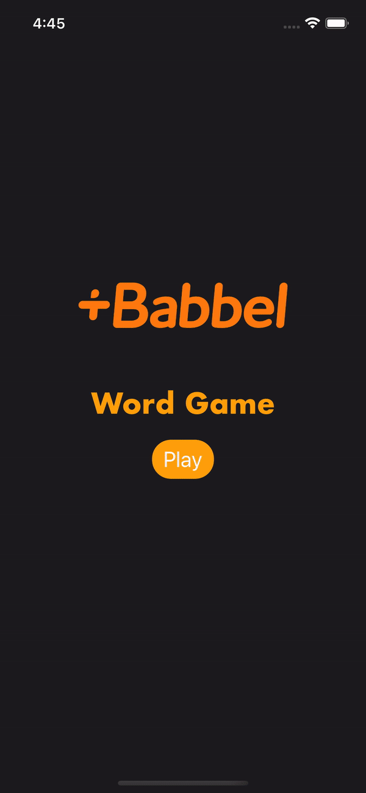

# Words Game

## Goal
The task is to write a small language game. At the end of the challenge, a user will see an English word on the screen. While the English word is displayed, a word in Spanish will appear.
The user has to choose if the Spanish word is the correct or wrong translation for the displayed word.

## Prereqs

- Xcode 13.4.1
- iOS 13+

## Demo


## Usage
```
Just open the project in Xcode 13+ and let SwiftPM do it's magic. :)
```
## Features
App is consist of two screens.
- Main Menu
- Game screen

Player can start the game by tapping the **Play** button.
Player can guess the Spanish translations dropping from top to bottom.
For each correct guess player get a single point (+1).
Player has 3 lives, each mistake costs a life.

## Technical Details
AppStart contains all the code needed for starting the app. The app is further divided into
- Scenes
- Domain
- Data layers

## Overall Architecture
This project is build using the Uncle [Clean architecture](https://blog.cleancoder.com/uncle-bob/2012/08/13/the-clean-architecture.html)

- **Domain**: Contains business logic and it's totally isolated from other parts of the app.
- **Data**: Data layer of the app. It contains the RepositoryInterface implementations to talk to Domain.
- **Scenes** : It's the UI part of the application. I have used MVVM to implement it.

## Unit Testing
App is using XCTest for unit tests.

## Test Coverage: 38.8%

## Decision made because of time restrictions
- Modularization (create separate swift packages for specific features).
- Better error handling
- Improve the UI/UX of the game.
- Add tools i.e static code analyser, setup CI/CD
- Implementation of more unit testing but i tried to write as much unit tests as possible.
